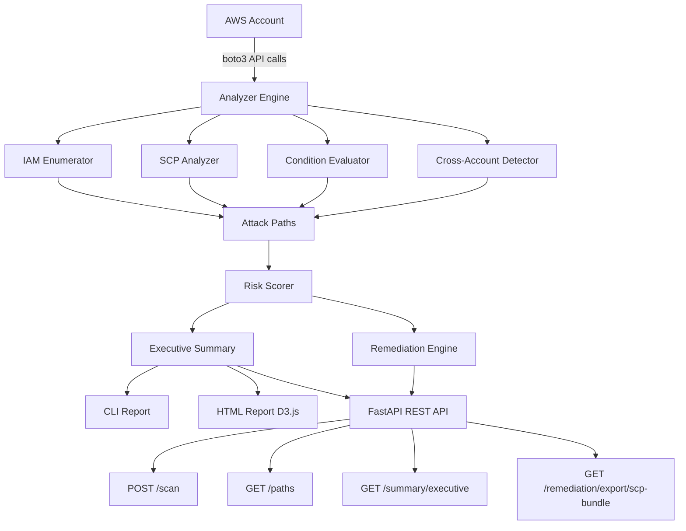
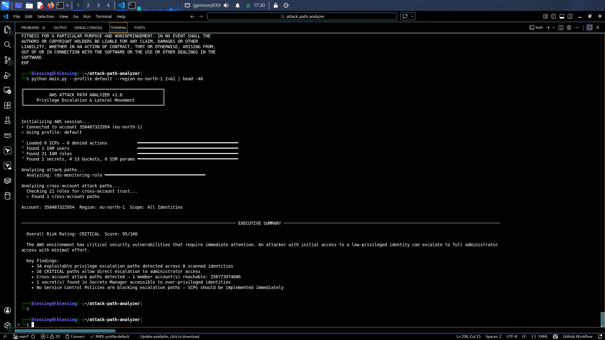
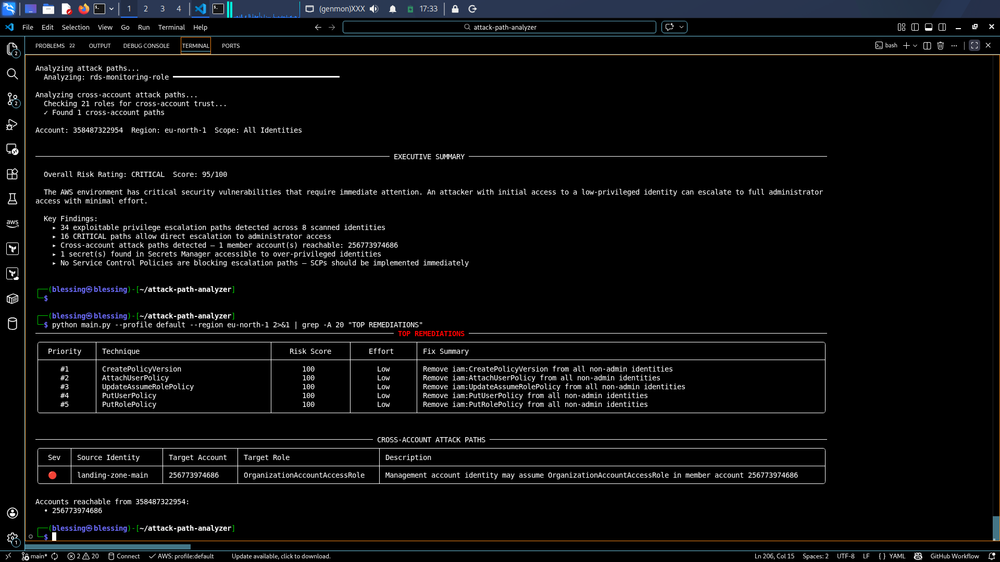
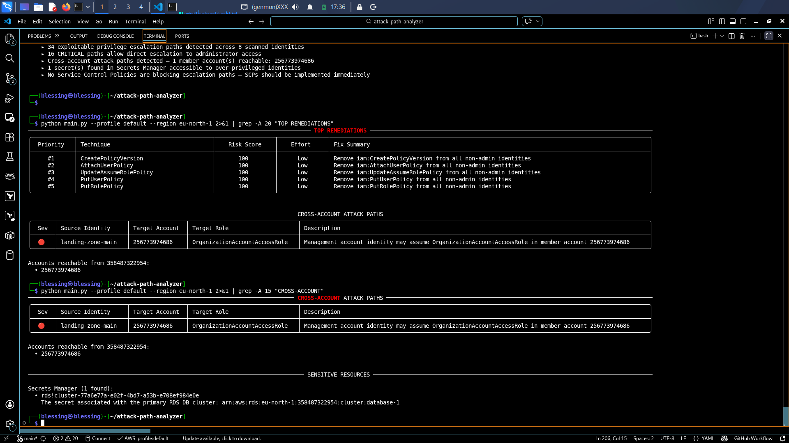
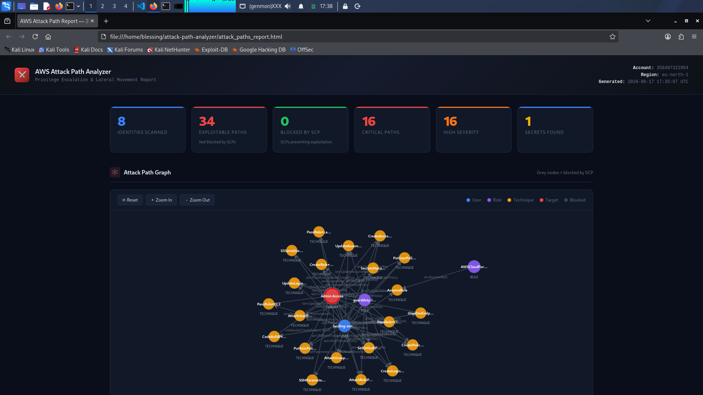

# ⚔️ AWS Attack Path Analyzer

> AWS Attack Path Analyzer discovers privilege escalation paths, lateral movement opportunities, cross-account attack chains, and exposed sensitive resources across AWS environments.


---

## What It Does

| Feature | Basic Tools | This Tool |
|---------|------------|-----------|
| IAM privesc detection | Yes | Yes |
| SCP awareness | No | Yes |
| Condition key evaluation | No | Yes |
| Cross-account path detection | No | Yes |
| Risk scoring (0-100) | No | Yes |
| Executive summary | No | Yes |
| Remediation guidance | No | Yes |
| SCP bundle export | No | Yes |
| REST API | No | Yes |
| Docker deployment | No | Yes |

---

## Real Findings — Live AWS Account

Tested against a real AWS account (eu-north-1):

- Overall Risk: CRITICAL 95/100
- Identities Scanned: 8
- Exploitable Paths: 34
- Critical Paths: 16
- Cross-Account Paths: 1 (Management to Log Archive)
- Secrets Exposed: 1 (RDS cluster secret)

---

## Privilege Escalation Techniques Covered

| Technique | Permissions Required | Severity | MITRE |
|-----------|---------------------|----------|-------|
| CreatePolicyVersion | iam:CreatePolicyVersion | Critical | T1098.001 |
| AttachUserPolicy | iam:AttachUserPolicy | Critical | T1098.001 |
| AttachGroupPolicy | iam:AttachGroupPolicy | Critical | T1098.001 |
| AttachRolePolicy | iam:AttachRolePolicy | Critical | T1098.001 |
| UpdateAssumeRolePolicy | iam:UpdateAssumeRolePolicy | Critical | T1098.001 |
| PutUserPolicy | iam:PutUserPolicy | Critical | T1098.001 |
| PutRolePolicy | iam:PutRolePolicy | Critical | T1098.001 |
| CreateRole+PassRole | iam:CreateRole, iam:PassRole | Critical | T1098.001 |
| AssumeRole to Admin | sts:AssumeRole | Critical | T1548 |
| PassRole+Lambda | iam:PassRole, lambda:* | High | T1648 |
| PassRole+EC2 | iam:PassRole, ec2:RunInstances | High | T1548 |
| PassRole+CloudFormation | iam:PassRole, cloudformation:* | High | T1648 |
| SecretsManagerAccess | secretsmanager:GetSecretValue | High | T1552.001 |
| CreateAccessKey | iam:CreateAccessKey | High | T1098.001 |
| CodeBuildPrivesc | codebuild:CreateProject, iam:PassRole | High | T1648 |
| GlueDevEndpoint | glue:CreateDevEndpoint | High | T1648 |
| SSMParameterAccess | ssm:GetParameter | Medium | T1552.001 |
| S3SensitiveRead | s3:GetObject | Medium | T1530 |
| SetDefaultPolicyVersion | iam:SetDefaultPolicyVersion | High | T1098.001 |

---

## Architecture


---

## Quick Start

### CLI

```bash
pip install -r requirements.txt
python main.py --profile default --region eu-north-1
```

### API

```bash
pip install fastapi uvicorn[standard]
uvicorn api.main:app --host 0.0.0.0 --port 8000 --reload

curl -X POST http://localhost:8000/api/v1/scan   -H "Content-Type: application/json"   -d '{"profile": "default", "region": "eu-north-1"}'
```

### Docker

```bash
docker-compose up --build
```

---

## API Endpoints

| Method | Endpoint | Description |
|--------|----------|-------------|
| POST | /api/v1/scan | Trigger full AWS account scan |
| GET | /api/v1/paths | Get all attack paths |
| GET | /api/v1/paths/top | Top paths by risk score |
| GET | /api/v1/paths/critical | Critical paths only |
| GET | /api/v1/paths/cross-account | Cross-account paths |
| GET | /api/v1/summary/executive | Executive summary |
| GET | /api/v1/summary/risk | Risk score breakdown |
| GET | /api/v1/remediation | Remediation guidance |
| GET | /api/v1/remediation/export/scp-bundle | Ready-to-deploy SCP document |

---

## Risk Scoring Methodology

| Factor | Weight | Description |
|--------|--------|-------------|
| Severity | 40 pts | Critical/High/Medium/Low |
| Exploitability | 30 pts | Number of permissions required |
| Asset Value | 20 pts | Admin/Secrets/Data/Lateral |
| Control Effectiveness | 10 pts | Deducted if SCP/conditions block it |

---

## Required IAM Permissions

Attach AWS managed policy SecurityAudit plus organizations read access.

---

## CI/CD Pipeline

GitHub Actions on every push:
1. Lint and syntax check all modules
2. Docker build and test
3. Bandit security scan
4. Demo HTML report artifact

---

## References

- Rhino Security Labs: https://rhinosecuritylabs.com/aws/aws-privilege-escalation-methods-mitigation/
- MITRE ATT&CK Cloud: https://attack.mitre.org/matrices/enterprise/cloud/
- AWS IAM Best Practices: https://docs.aws.amazon.com/IAM/latest/UserGuide/best-practices.html

---

## Author

**Toriola Opeyemi** — Cloud Security Engineer

- GitHub: https://github.com/GeekyBlessing
- LinkedIn: https://linkedin.com/in/toriola-opeyemi
- Substack: https://geekyblessing.substack.com

## 📸 Live Scan Results

### Executive Summary



### Remediation Guidance & Cross-Account Paths



### Interactive HTML Dashboard



### Risk Scoring



